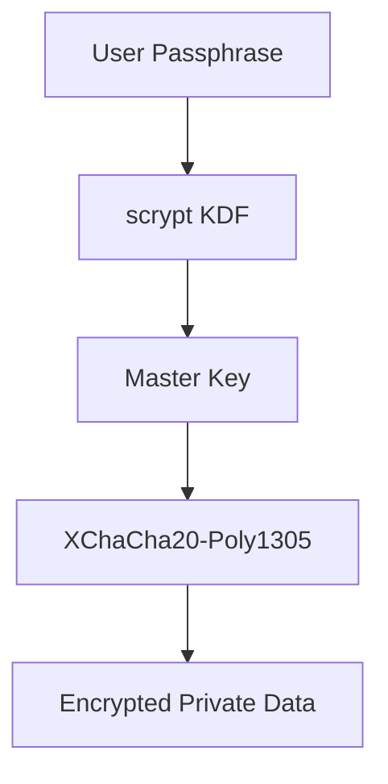

# ADR 0007: XChaCha20-Poly1305 Encryption

## 1. Context

As part of the broader effort to simplify wallet encryption to a single
passphrase model, we are revisiting the cryptographic primitives used to
protect sensitive data. Today, `btcwallet` relies on NaCl secretbox, based on
XSalsa20-Poly1305, to encrypt private key material.

While XSalsa20-Poly1305 remains secure, XChaCha20-Poly1305 is now the
preferred successor in modern systems. It preserves the large nonce model
while offering better library support and alignment with current AEAD
standards.

Key motivations for this change include:

* Broad adoption of XChaCha20-Poly1305 in modern cryptographic systems
* Strong performance on systems without AES-NI, including mobile and embedded
  environments
* Simpler and more uniform AEAD construction, reducing implementation risk
* Easier auditing due to reduced complexity
* Production-proven usage in the Lightning Network's encrypted transport
  protocol ([BOLT
  8](https://github.com/lightning/bolts/blob/master/08-transport.md)),
  demonstrating its suitability for Bitcoin-related projects

Like XSalsa20, XChaCha20-Poly1305 uses a 192-bit nonce, which allows random
nonce generation without practical collision risk and matches our existing
nonce strategy.

## 2. Decision

We will migrate the encryption primitive from NaCl secretbox, based on
XSalsa20-Poly1305, to **XChaCha20-Poly1305**.

### Key aspects

1. **Encryption primitive**
   Use XChaCha20-Poly1305 from `golang.org/x/crypto/chacha20poly1305`,
   specifically the XChaCha variant with 192-bit nonces.

2. **Key hierarchy**
   Preserve the existing structure: scrypt-based KDF, master key derivation,
   and per-use encryption keys.

3. **Data separation**
   Continue storing public data in plaintext while encrypting private or
   sensitive material only.

4. **Migration path**
   Encrypted data will be re-encrypted during the SQL migration process.

## 3. Consequences

### Pros

* **Performance**
   Strong performance in pure software environments, especially where AES-NI
   is unavailable.

* **Modern AEAD**
  Aligns the codebase with current best practice for authenticated encryption.

* **Lower implementation risk**
  Fewer edge cases compared to AES-GCM or custom constructions.

* **Auditability**
  Smaller and clearer code paths improve reviewability and long-term
  maintenance.

* **Nonce safety**
   The 192-bit nonce space allows safe random nonce generation and preserves
   compatibility with existing designs.

### Cons

* **Migration cost**
  All encrypted data must be re-encrypted during migration.

* **Temporary dual support**
  XSalsa20-Poly1305 must remain supported until migration is complete.

* **Testing overhead**
  Both encryption paths require validation during the transition period.

* **Passphrase dependency**
  Re-encryption is only possible when the user passphrase is available.

## 4. Status

Proposed.
