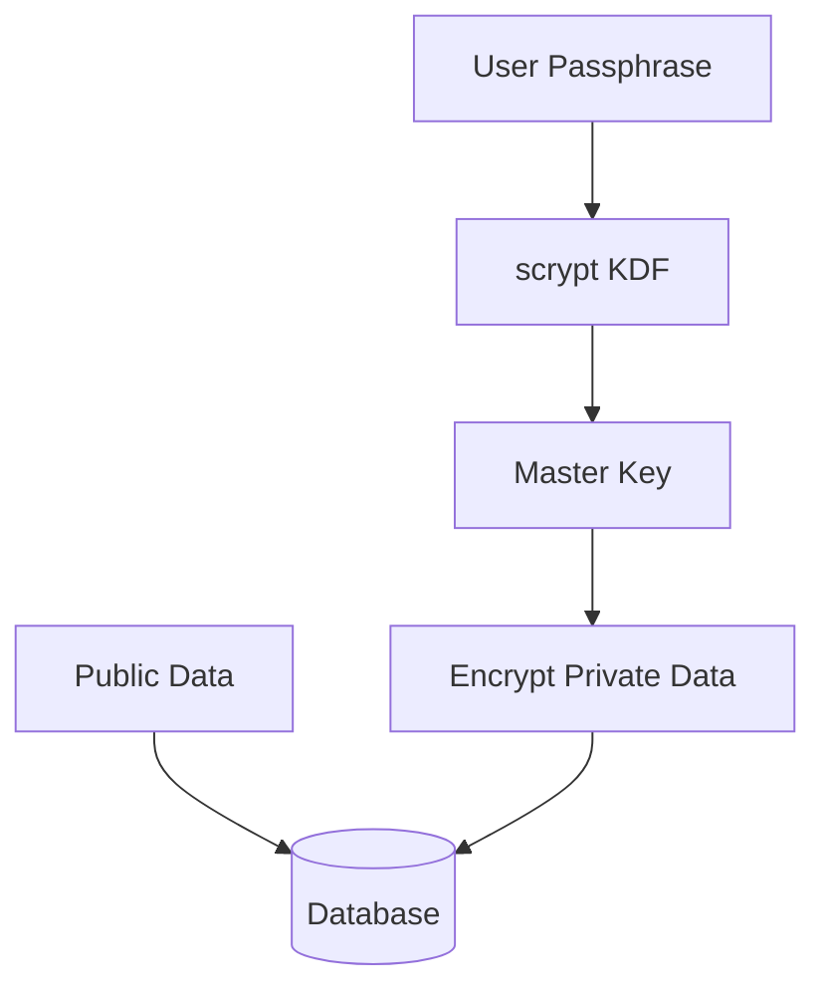

# ADR 0009: Single-Passphrase Encryption Model

## 1. Context

`btcwallet` is migrating from a key-value database (kvdb) to a SQL-based
backend. This transition requires a clean, consistent encryption model that
works across SQLite and PostgreSQL.

The legacy system used a dual-passphrase hierarchy with separate public and
private encryption keys. In practice, downstream systems often set the public
passphrase to a known constant to allow auto-start, which negated the privacy
benefits while keeping the complexity. This model also diverges from the
industry standard set by Bitcoin Core and libraries like BDK.

The design notes that guided this change are captured in
[Single-Passphrase Encryption Design Notes](https://gist.github.com/yyforyongyu/edfeee0f84cf79851735bcc3e740a871).

## 2. Decision

We will adopt a **Single-Passphrase Model** that encrypts **private data only**
and leaves public data in plaintext.

### Key points

1. **One master encryption key** derived from the user passphrase
2. **Private data encrypted** (private keys, HD seeds, xprivs, scripts)
3. **Public data plaintext** (addresses, pubkeys, transactions, balances)
4. **Simplified hierarchy** by removing `CryptoPubKey` and `CryptoScriptKey`

## 3. Consequences

### Pros

* **Simplicity**: Eliminates dual passphrase logic.
* **Performance**: Read-only operations no longer require decrypting public
  data, reducing query overhead.
* **Interoperability**: Aligns with Bitcoin Core and BDK conventions.
* **UX clarity**: Users only need a single passphrase.

### Cons

* **Privacy at rest**: Transaction history, balances, and public keys are
  exposed if the database is compromised, consistent with Bitcoin Core tradeoffs.
  If stronger protection is required, users can rely on full disk encryption such
  as LUKS.
* **Migration effort**: Existing wallets must be migrated away from the legacy
  dual passphrase model. This work will be done along with the SQL backend migration.

## 4. Threat Model and Security Boundaries

This model protects private key material at rest when an attacker can read the
database but cannot guess the wallet passphrase.

This model does not protect metadata privacy if the database contents are
exfiltrated. Addresses, balances, and transaction history remain visible by
design.

Operational mitigations required for this model:

* Full disk encryption for database files.
* Host hardening (least privilege, patching, endpoint protection).
* Encrypted backups with independent access controls and key management.

## 5. Status

Accepted.
