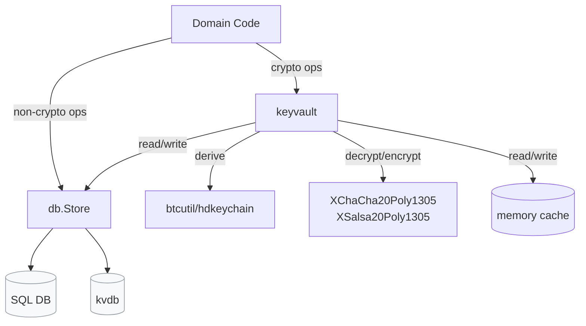

# ADR 0010: Keyvault Encryption Layer

## 1. Context

The updated encryption model defined in ADR 0009 and the planned
cryptographic primitive migration proposed in ADR 0007 require a clear
boundary between domain logic and the SQL database layer. The
legacy `waddrmgr` design tightly couples storage, locking, and key derivation,
which complicates the SQL migration and makes encryption behavior hard to test
in isolation.

To address this, we need a dedicated component that owns lock state, key
derivation, and encryption, while keeping the database layer strictly
encryption agnostic.

The `db.Store` remains available to other callers for non-cryptographic
queries and updates.

## 2. Decision

We will introduce a dedicated **`wallet/internal/keyvault`** package that
defines the encryption boundary between domain code and the SQL store layer.
Keyvault accesses the database through `db.Store`, not by talking directly
to the SQL backend.

### Responsibilities

1. **Own lock state and key lifecycle**
   Centralized management of unlock state, key derivation, key material
   lifetime, and secure memory zeroing.

2. **Expose typed domain interfaces**
   Methods return `*btcec.PrivateKey`, `*btcec.PublicKey`, and
   `btcutil.Address` instead of encrypted `[]byte` values.

3. **Handle HD derivation**
   Use `btcutil/hdkeychain` for BIP32 and BIP44 derivation and return or
   persist derived keys as needed.

4. **Maintain an in-memory cache**
   Cache account level and derived keys to avoid repeated derivation and
   database reads.

5. **Support multi-wallet operation**
   A single keyvault instance manages multiple wallets via `wallet_id`
   parameters.

6. **Track current and planned cryptographic primitives**
   Encryption follows the accepted single-passphrase model in ADR 0009 and
   adopts ADR 0007 once the XChaCha20-Poly1305 migration is implemented.

7. **Coexist with `waddrmgr` during migration**
   New code uses keyvault while legacy code continues to rely on
   `waddrmgr` until the migration is complete.

## 3. Consequences

### Pros

* **Separation of concerns**
   Database code stores opaque bytes without knowledge of cryptography or lock
   state.

* **Type safety**
  Callers work with strongly typed keys rather than raw blobs.

* **Centralized lock management**
  Prevents lock state divergence across components.

* **Performance**
  Caching reduces repeated derivation and database access.

* **Testability**
   Keyvault can be tested against mock databases, and domain logic can be
   tested using mock keyvault implementations.

* **Memory safety**
  Secure memory handling and zeroing are centralized in one place.

### Cons

* **Additional abstraction**
  Introduces a new package boundary that must be maintained.

* **Migration cost**
  Existing code paths must be refactored to use the new keyvault API.

* **Temporary dual systems**
   `waddrmgr` and keyvault will coexist during the transition period,
   increasing short-term complexity.

## 4. Status

Accepted.
