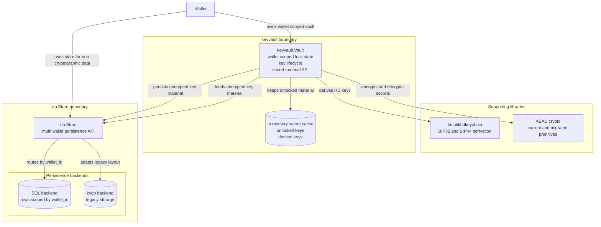

# ADR 0010: Keyvault Encryption Layer

## 1. Context

The encryption model defined in ADR 0009 and the cryptographic primitive
migration proposed in ADR 0007 require a clear boundary between wallet domain
logic and database persistence.

The legacy `waddrmgr` design couples storage, locking, key derivation, and
encryption. This makes the SQL migration harder, spreads encryption behavior
across persistence code, and makes lock state difficult to test in isolation.

We need a dedicated component that owns lock state, key derivation, secret
material lifetime, and encryption. The database layer should remain encryption
agnostic and store encrypted key material as opaque bytes.

The `db.Store` remains available to other wallet code for non-cryptographic
queries and updates.

## 2. Decision

We will introduce a dedicated `wallet/internal/keyvault` package. This package
defines the encryption boundary between wallet domain code and the store layer.

A wallet facing `keyvault.Vault` is scoped to exactly one wallet at construction
time. It receives a `db.Store` and a wallet identifier during wiring, then keeps
persistence routing internal. Callers that hold a vault do not pass a wallet ID
to each lock, unlock, encrypt, decrypt, or derivation operation.

Keyvault accesses persistence through `db.Store`. It does not talk directly to
SQL backends.

This is a structural boundary diagram, not a runtime call sequence.

The `Wallet` struct holds two related dependencies:

1. A wallet scoped `keyvault.Vault`
2. A multi wallet `db.Store`

Encrypted key material flows through the vault. Non-cryptographic wallet data
may still flow directly through the store.

The store remains the persistence boundary for wallet data and keeps wallet ID
routing inside the store or adapter layer. The vault hides that routing from
wallet facing lock, unlock, encryption, decryption, and derivation APIs.

### Responsibilities

1. **Own lock state and key lifecycle**
   Keyvault manages lock state, key material lifetime, and secure memory
   zeroing.

2. **Expose typed domain interfaces**
   Keyvault returns domain types such as `*btcec.PrivateKey`,
   `*btcec.PublicKey`, and `btcutil.Address` instead of exposing encrypted byte
   slices to wallet code.

3. **Handle HD derivation**
   Keyvault uses `btcutil/hdkeychain` for BIP32 and BIP44 derivation and returns
   or persists derived key material as needed.

4. **Maintain an in memory secret cache**
   Keyvault may cache account level keys and derived keys while unlocked to
   avoid repeated derivation and database reads.

5. **Keep wallet facing APIs scoped to one wallet**
   A wallet facing `keyvault.Vault` is configured for one wallet during
   construction. Callers do not pass a wallet ID to every vault method.

6. **Track current and planned cryptographic primitives**
   Keyvault follows the single passphrase model accepted in ADR 0009 and adopts
   the ADR 0007 primitive migration once implemented.

7. **Coexist with `waddrmgr` during migration**
   New code uses keyvault while legacy code continues to rely on `waddrmgr`
   until the migration is complete.

## 3. Consequences

The wallet facing `keyvault.Vault` API intentionally does not expose wallet ID
parameters on methods such as `Unlock`, `Lock`, `IsLocked`, `Encrypt`,
`Decrypt`, or key derivation methods.

Code that holds a vault already holds the vault selected for that wallet.
Requiring every method call to pass a wallet ID would push database routing into
controllers, accounts, addresses, and tests. It would also make cross wallet
mistakes possible at every call site.

The SQL and store layers remain multi wallet aware through `wallet_id` fields
and parameters, consistent with ADR 0001. That routing is handled inside store
implementations or keyvault adapters, not repeated throughout wallet domain
code.

Auto lock timeout scheduling is a wallet or controller lifecycle policy, not
part of `keyvault.Vault`.

### Pros

1. **Separation of concerns**
   Database code stores opaque encrypted bytes without knowing about
   cryptography, lock state, or key derivation.

2. **Type safety**
   Wallet code works with typed keys and addresses instead of raw encrypted
   blobs.

3. **Centralized lock management**
   Lock state and secret zeroing are owned by one component, while timeout and
   auto lock scheduling stay outside the vault.

4. **Extensible responsibility boundary**
   Keyvault centralizes secret and key responsibilities, making it easier to
   add future responsibilities behind the same boundary without spreading
   changes across wallet callers.

5. **Lower call site complexity**
   Wallet, account, address, and controller code can use a vault without
   threading wallet IDs through every encryption or key access operation.

6. **Better testability**
   Keyvault can be tested against mock stores, and wallet domain code can be
   tested against mock vault implementations.

7. **Per wallet isolation**
   Each wallet has its own vault instance, lock state, cache, and secret
   material lifetime.

8. **Migration support**
   Keyvault can coexist with `waddrmgr`, allowing new SQL backed paths to move
   behind the new boundary before legacy paths are removed.

### Cons

1. **Additional abstraction**
   The design introduces a new package boundary that must be maintained.

2. **Migration cost**
   Existing code paths must be refactored to use the new keyvault API.

3. **Temporary dual systems**
   `waddrmgr` and keyvault will coexist during the migration, increasing
   temporary complexity.

4. **Boundary discipline**
   Implementations must keep wallet ID routing inside constructors, adapters, or
   store methods. Exposing wallet ID on every vault method is rejected.

5. **Constructor and adapter indirection**
   Wiring a vault from `db.Store` plus wallet ID adds an adapter boundary
   between wallet domain code and persistence. That boundary is intentional, but
   future changes must keep it aligned with store methods that remain multi
   wallet aware.

## 4. Status

Accepted.
